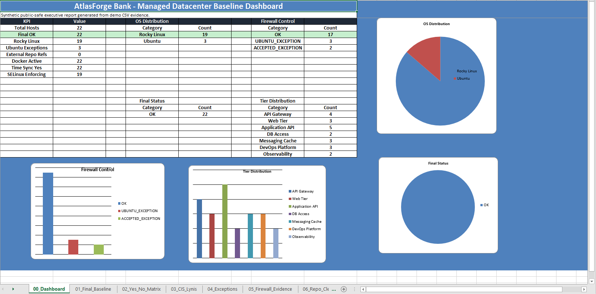
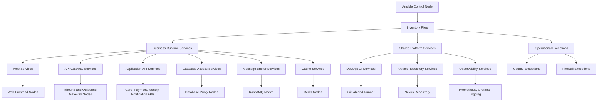
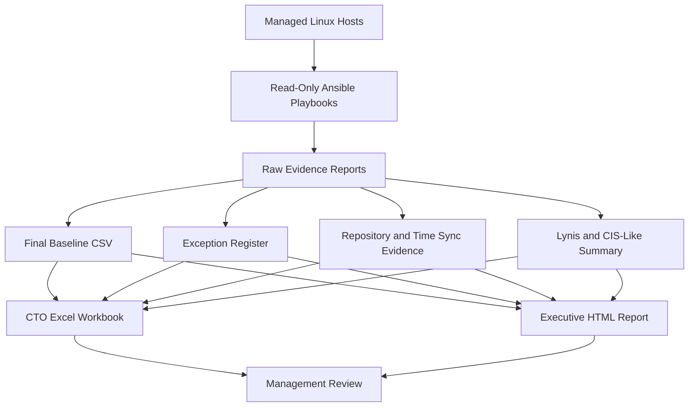

# Ansible Managed Datacenter Baseline

<p align="center">
  
</p>

<p align="center">
  
  
  
  
</p>

<p align="center">
  
  
  
  
</p>

<p align="center">
  
  
  
</p>

Production-style public demo repository for **Ansible Managed Datacenter Baseline Automation**.

This repository shows how to build a reusable Ansible baseline framework for Linux fleet auditing, service-based inventory modeling, read-only evidence collection, operational exception tracking, and executive reporting.

The project uses **fully synthetic data** and is safe for public GitHub, training, workshops, and internal DevOps documentation.

> **Public-data disclaimer**
> This repository contains synthetic demo data only.
> It does not contain real infrastructure data, real IP addresses, real domains, secrets, tickets, usernames, or production evidence.

---

## What This Repository Solves

Enterprise infrastructure teams usually need a repeatable way to answer questions like:

* Which Linux servers are inside managed scope?
* Which systems are standard Rocky Linux nodes?
* Which systems are approved Ubuntu or firewall exceptions?
* Are repository configurations clean?
* Is time synchronization healthy?
* Is Docker active where expected?
* Is SELinux visible in baseline reports?
* Are operational exceptions documented?
* Can we generate manager-ready Excel and HTML reports?

This repository provides a practical baseline pattern for those workflows.

---

## Synthetic Environment

| Item                | Value                               |
| ------------------- | ----------------------------------- |
| Company             | AtlasForge Bank                     |
| Business Unit       | Digital Infrastructure Engineering  |
| Environment         | On-Prem / Air-Gapped Datacenter Lab |
| Domain              | atlasforge.example                  |
| Registry            | registry.atlasforge.example         |
| Git Server          | git.atlasforge.example              |
| Artifact Repository | nexus.atlasforge.example            |
| NTP Source          | ntp01.atlasforge.example            |

All names, domains, IP addresses, hostnames, and report values are fictional.

---

## Synthetic Scope

| Metric                         | Value |
| ------------------------------ | ----: |
| Total managed hosts            |    22 |
| Rocky Linux managed hosts      |    19 |
| Ubuntu exception hosts         |     3 |
| Docker active                  |    22 |
| Time sync healthy              |    22 |
| External repository references |     0 |

---

## Service Group Model

The inventory is organized by **service responsibility**, not only by operating system or hostname.

```text
AtlasForge Bank - Synthetic Managed Datacenter
├── Business Runtime Services
│   ├── Web Services
│   ├── API Gateway Services
│   ├── Application API Services
│   ├── Database Access Services
│   ├── Message Broker Services
│   └── Cache Services
└── Shared Platform Services
    ├── DevOps CI Services
    ├── Artifact Repository Services
    └── Observability Services
```

Primary service groups:

```text
web_services
api_gateway_services
application_api_services
database_access_services
message_broker_services
cache_services
devops_ci_services
artifact_repository_services
observability_services
```

Operational exception groups:

```text
firewalld_operational_exception
ubuntu_operational_exception
```

---

## Visual Architecture

### Service-Based Inventory Architecture



### Real Inventory Adoption Workflow

```mermaid
flowchart LR
    A[Clone Public Repository] --> B[Create Private Internal Copy]
    B --> C[Backup Synthetic Inventory]
    C --> D[Replace hosts.yml]
    D --> E[Replace Service Groups]
    E --> F[Replace OS Scope]
    F --> G[Replace group_vars]
    G --> H[Validate Inventory Graph]
    H --> I[Test One Host]
    I --> J[Test One Service Group]
    J --> K[Run Read-Only Baseline]
    K --> L[Generate Excel and HTML Reports]
```



### Baseline Reporting Pipeline



---

## Repository Layout

```text
ansible-managed-dc-baseline/
├── README.md
├── LICENSE
├── .gitignore
├── ansible.cfg
├── inventory/
│   ├── hosts.yml
│   ├── 90-active-groups.yml
│   └── 91-managed-os-scope.yml
├── group_vars/
│   └── all/
│       └── main.yml
├── host_vars/
│   └── .gitkeep
├── files/
│   └── yum.repos.d/
├── templates/
│   └── apt.sources.list.d/
├── playbooks/
├── scripts/
├── reports/
├── docs/
├── archive/
└── examples/
```

---

## Quick Start

### 1. Clone the repository

Using SSH:

```bash
git clone git@github.com:ahmadsheikhi89/ansible-managed-dc-baseline.git
cd ansible-managed-dc-baseline
```

Using HTTPS:

```bash
git clone https://github.com/ahmadsheikhi89/ansible-managed-dc-baseline.git
cd ansible-managed-dc-baseline
```

---

### 2. Install prerequisites

Rocky Linux, RHEL, Fedora:

```bash
sudo dnf install -y ansible-core
sudo dnf install -y python3 python3-openpyxl
sudo dnf install -y git unzip jq
```

Ubuntu, Debian:

```bash
sudo apt update
sudo apt install -y ansible
sudo apt install -y python3 python3-openpyxl
sudo apt install -y git unzip jq
```

Air-gapped environments should install packages from an approved internal repository or offline package mirror.

---

### 3. Validate local tools

```bash
ansible --version
python3 --version
git --version
```

Validate Python Excel support:

```bash
python3 -c "import openpyxl; print(openpyxl.__version__)"
```

---

## Run the Synthetic Demo

### 1. Validate inventory graph

```bash
ansible-inventory \
  -i inventory/hosts.yml \
  -i inventory/90-active-groups.yml \
  -i inventory/91-managed-os-scope.yml \
  --graph
```

### 2. Validate inventory as JSON

```bash
ansible-inventory \
  -i inventory/hosts.yml \
  -i inventory/90-active-groups.yml \
  -i inventory/91-managed-os-scope.yml \
  --list
```

### 3. Validate one playbook syntax

```bash
ansible-playbook \
  -i inventory/hosts.yml \
  -i inventory/90-active-groups.yml \
  -i inventory/91-managed-os-scope.yml \
  playbooks/20-fleet-readonly-report.yml \
  --syntax-check
```

### 4. List target hosts before running

```bash
ansible-playbook \
  -i inventory/hosts.yml \
  -i inventory/90-active-groups.yml \
  -i inventory/91-managed-os-scope.yml \
  playbooks/20-fleet-readonly-report.yml \
  --list-hosts
```

### 5. Run a read-only demo playbook

```bash
ansible-playbook \
  -i inventory/hosts.yml \
  -i inventory/90-active-groups.yml \
  -i inventory/91-managed-os-scope.yml \
  playbooks/20-fleet-readonly-report.yml
```

---

## Generate Reports

### Generate demo data

```bash
python3 scripts/generate-demo-data.py
```

### Generate CTO Excel workbook

```bash
python3 scripts/build-final-manager-excel.py
```

Output:

```text
reports/final/managed-dc-baseline-cto.xlsx
```

Workbook sheets:

```text
00_Dashboard
01_Final_Baseline
02_Yes_No_Matrix
03_CIS_Lynis
04_Exceptions
05_Firewall_Evidence
06_Repo_Cleanup
07_Control_Checklist
```

### Generate executive HTML report

```bash
python3 scripts/build-final-manager-report.py
```

Outputs:

```text
docs/executive/managed-dc-baseline-report.html
docs/executive/managed-dc-baseline-report.md
docs/executive/charts/*.svg
```

---

## Use This Repository With Your Own Inventory

This repository is designed so teams can clone it, keep the structure, and replace synthetic data with their own approved internal inventory.

> Do not commit real infrastructure data to a public fork.
> Use a private internal Git repository before adding real IP addresses, domains, hostnames, usernames, reports, or evidence.

---

### 1. Create a private internal copy

Clone the public demo:

```bash
git clone git@github.com:ahmadsheikhi89/ansible-managed-dc-baseline.git
cd ansible-managed-dc-baseline
```

Remove the public GitHub remote:

```bash
git remote remove origin
```

Add your internal Git remote:

```bash
git remote add origin git@git.example.internal:platform/ansible-managed-dc-baseline.git
```

Push to your private internal repository:

```bash
git push -u origin main
```

---

### 2. Back up synthetic demo files

```bash
mkdir -p archive/bootstrap
```

```bash
cp -a inventory archive/bootstrap/inventory-synthetic-demo
```

```bash
cp -a group_vars archive/bootstrap/group-vars-synthetic-demo
```

```bash
cp -a reports archive/bootstrap/reports-synthetic-demo
```

---

### 3. Replace `inventory/hosts.yml`

Use this file for real host definitions, IP addresses, SSH variables, and host-level metadata.

Example:

```yaml
---
all:
  hosts:
    web-prd-01:
      ansible_host: 10.10.20.11
      ansible_user: ansible
      ansible_port: 22
      ansible_become: true
      service_name: web-prd-01
      service_role: production_web_frontend
      environment: production
      os_family_expected: rocky

    api-gw-in-01:
      ansible_host: 10.10.20.21
      ansible_user: ansible
      ansible_port: 22
      ansible_become: true
      service_name: api-gw-in-01
      service_role: inbound_api_gateway
      environment: production
      os_family_expected: rocky
```

Recommended host variables:

```yaml
ansible_host: 10.10.20.11
ansible_user: ansible
ansible_port: 22
ansible_become: true
service_name: web-prd-01
service_role: production_web_frontend
environment: production
os_family_expected: rocky
```

---

### 4. Replace `inventory/90-active-groups.yml`

Use this file to map hosts to service groups.

Example:

```yaml
---
all:
  children:
    business_runtime_services:
      children:
        web_services:
        api_gateway_services:
        application_api_services:
        database_access_services:
        message_broker_services:
        cache_services:

    shared_platform_services:
      children:
        devops_ci_services:
        artifact_repository_services:
        observability_services:

    web_services:
      hosts:
        web-prd-01:
        web-prd-02:

    api_gateway_services:
      hosts:
        api-gw-in-01:
        api-gw-out-01:

    application_api_services:
      hosts:
        api-core-prd-01:
        api-payment-prd-01:

    database_access_services:
      hosts:
        db-proxy-01:
        db-proxy-02:

    message_broker_services:
      hosts:
        rmq-01:
        rmq-02:

    cache_services:
      hosts:
        redis-01:

    devops_ci_services:
      hosts:
        gitlab-01:
        gitlab-runner-01:

    artifact_repository_services:
      hosts:
        nexus-01:

    observability_services:
      hosts:
        monitor-01:
        log-01:

    firewalld_operational_exception:
      hosts:
        gitlab-01:
        gitlab-runner-01:

    ubuntu_operational_exception:
      hosts:
        log-01:
```

---

### 5. Replace `inventory/91-managed-os-scope.yml`

Use this file to separate standard managed operating systems from approved exceptions.

Example:

```yaml
---
all:
  children:
    rocky_managed:
      hosts:
        web-prd-01:
        api-gw-in-01:
        api-core-prd-01:
        db-proxy-01:
        rmq-01:
        redis-01:
        nexus-01:
        monitor-01:

    ubuntu_exception:
      hosts:
        gitlab-01:
        gitlab-runner-01:
        log-01:
```

---

### 6. Replace `group_vars/all/main.yml`

Use this file for baseline policy values.

Example:

```yaml
---
company_name: "Example Internal Company"
business_unit: "Digital Infrastructure Engineering"
environment_name: "production"

internal_domain: "example.internal"
internal_registry: "registry.example.internal"
internal_git: "git.example.internal"
internal_artifact_repo: "nexus.example.internal"
ntp_source: "ntp01.example.internal"

baseline_report_owner: "Infrastructure Automation Team"
baseline_execution_mode: "read_only"
```

Do not store secrets in `group_vars`.

---

## Real Inventory Validation Workflow

### 1. Confirm inventory parses

```bash
ansible-inventory \
  -i inventory/hosts.yml \
  -i inventory/90-active-groups.yml \
  -i inventory/91-managed-os-scope.yml \
  --graph
```

### 2. Confirm playbook target selection

```bash
ansible-playbook \
  -i inventory/hosts.yml \
  -i inventory/90-active-groups.yml \
  -i inventory/91-managed-os-scope.yml \
  playbooks/20-fleet-readonly-report.yml \
  --list-hosts
```

### 3. Test one host first

```bash
ansible all \
  -i inventory/hosts.yml \
  -i inventory/90-active-groups.yml \
  -i inventory/91-managed-os-scope.yml \
  -m ping \
  --limit web-prd-01
```

### 4. Test one service group

```bash
ansible web_services \
  -i inventory/hosts.yml \
  -i inventory/90-active-groups.yml \
  -i inventory/91-managed-os-scope.yml \
  -m ping
```

### 5. Run one read-only playbook against one host

```bash
ansible-playbook \
  -i inventory/hosts.yml \
  -i inventory/90-active-groups.yml \
  -i inventory/91-managed-os-scope.yml \
  playbooks/20-fleet-readonly-report.yml \
  --limit web-prd-01
```

### 6. Run the final read-only baseline

```bash
ansible-playbook \
  -i inventory/hosts.yml \
  -i inventory/90-active-groups.yml \
  -i inventory/91-managed-os-scope.yml \
  playbooks/99-final-managed-dc-baseline-readonly.yml
```

---

## Read-Only Audit Playbooks

Run playbooks one by one.

Classify operating systems:

```bash
ansible-playbook playbooks/19-classify-os.yml
```

Generate fleet report:

```bash
ansible-playbook playbooks/20-fleet-readonly-report.yml
```

Audit DNF repositories:

```bash
ansible-playbook playbooks/22-audit-dnf-repos.yml
```

Audit Ubuntu APT configuration without update:

```bash
ansible-playbook playbooks/24-audit-ubuntu-apt-no-update.yml
```

Audit Rocky EPEL state:

```bash
ansible-playbook playbooks/57-audit-rocky-epel-basic.yml
```

Audit Lynis availability:

```bash
ansible-playbook playbooks/59-audit-lynis-availability.yml
```

Run Lynis summary report for Rocky hosts:

```bash
ansible-playbook playbooks/61-run-lynis-rocky-report.yml
```

Run CIS preflight read-only report:

```bash
ansible-playbook playbooks/67-cis-preflight-basic-readonly-report.yml
```

Audit external repository references:

```bash
ansible-playbook playbooks/69-audit-external-repo-refs-readonly.yml
```

Audit time synchronization:

```bash
ansible-playbook playbooks/71-audit-time-sync-readonly.yml
```

Audit selected chrony source:

```bash
ansible-playbook playbooks/72-audit-chrony-selected-source-readonly.yml
```

Audit firewalld exceptions:

```bash
ansible-playbook playbooks/73-audit-gitlab-firewalld-readonly.yml
```

Run final managed datacenter baseline report:

```bash
ansible-playbook playbooks/99-final-managed-dc-baseline-readonly.yml
```

---

## Safe Production Practice

Before running any playbook in a real environment, validate the target list:

```bash
ansible-playbook playbooks/99-final-managed-dc-baseline-readonly.yml --list-hosts
```

Validate syntax:

```bash
ansible-playbook playbooks/99-final-managed-dc-baseline-readonly.yml --syntax-check
```

Run against one host first:

```bash
ansible-playbook playbooks/99-final-managed-dc-baseline-readonly.yml --limit web-prd-01
```

For any playbook that may change state, test with check mode and diff:

```bash
ansible-playbook playbooks/example.yml --check --diff
```

---

## Operational Exceptions

This repository demonstrates exception tracking instead of hiding non-standard systems.

Example exception groups:

```text
firewalld_operational_exception
ubuntu_operational_exception
```

Example exception report:

```text
reports/exceptions/74-firewalld-operational-exceptions.csv
```

Policy expectation:

```text
Exceptions must be documented, approved, time-bound, and visible in executive reporting.
```

---

## Reports

Final baseline CSV:

```text
reports/final/99-managed-dc-baseline-readonly.csv
```

CTO Excel workbook:

```text
reports/final/managed-dc-baseline-cto.xlsx
```

Executive HTML report:

```text
docs/executive/managed-dc-baseline-report.html
```

Executive Markdown report:

```text
docs/executive/managed-dc-baseline-report.md
```

Chart files:

```text
docs/executive/charts/
```

---

## Mermaid Diagrams

GitHub-compatible Mermaid diagrams are available in this README and under:

```text
docs/diagrams/
```

Validate Mermaid blocks:

````bash
grep -RIn '^```mermaid$' README.md docs/diagrams/*.md
````

Avoid advanced Mermaid syntax that may not render consistently on GitHub.

---

## Safe Evidence Archiving

Create a dated archive:

```bash
mkdir -p archive/$(date +%Y%m%d)
```

Copy reports into the archive:

```bash
cp -a reports archive/$(date +%Y%m%d)/reports-snapshot
```

Do not archive:

```text
Secrets
Tokens
Private keys
Raw production logs
Unmasked vulnerabilities
Customer data
Internal ticket exports
```

---

## Git Workflow for Internal Teams

Create a working branch:

```bash
git checkout -b feature/update-real-inventory
```

Check changes:

```bash
git status
```

Stage inventory and policy files:

```bash
git add inventory group_vars
```

Commit changes:

```bash
git commit -m "Add internal production inventory baseline"
```

Push branch:

```bash
git push origin feature/update-real-inventory
```

Merge only after peer review.

---

## Public Fork Rules

Do not push these items to a public repository:

```text
Real inventory
Real IP addresses
Real domains
Real hostnames
Real reports
Security findings
Customer data
Credentials
Tokens
Private keys
Vault passwords
```

---

## Troubleshooting

| Problem                    | Check                                               |
| -------------------------- | --------------------------------------------------- |
| Inventory does not load    | `ansible-inventory --graph -vvv`                    |
| Host not matched by group  | `ansible-inventory --graph`                         |
| SSH fails                  | `ssh -vvv user@host`                                |
| Ansible ping fails         | `ansible all -m ping --limit host`                  |
| Privilege escalation fails | Check `ansible_become`, sudo policy, and SSH user   |
| Excel script fails         | Install `python3-openpyxl`                          |
| HTML charts missing        | Run `python3 scripts/build-final-manager-report.py` |
| Mermaid does not render    | Keep Mermaid syntax simple and GitHub-compatible    |
| GitHub SSH fails           | `ssh -T git@github.com`                             |

---

## FAQ

### Is this real banking data?

No. Everything is synthetic and public-safe.

### Can I use this inside my organization?

Yes. Clone the repository into a private internal Git server, then replace the synthetic inventory, reports, exception registers, and policy values with approved internal data.

### Does this modify hosts?

The baseline workflow is designed around read-only evidence collection. Any playbook that may change state should be reviewed separately and tested with `--check --diff`.

### Why include Ubuntu exception hosts?

Enterprise environments often include exception systems. This repository demonstrates how to track them transparently instead of hiding them from reporting.

### Should I publish my real inventory?

No. Keep real hostnames, IP addresses, domains, and reports inside private internal repositories only.

---

## Contribution Guide

* Keep all sample data synthetic
* Keep comments and code in English
* Do not commit secrets
* Do not commit production output
* Keep Mermaid diagrams GitHub-compatible
* Keep reports deterministic
* Prefer read-only evidence collection first
* Keep service groups clear and reusable
* Document every operational exception

---

## Roadmap

* Add CI validation for YAML and Markdown
* Add Ansible syntax-check workflow
* Add optional Molecule tests
* Add AWX or Tower job template examples
* Add signed release checklist
* Add optional Grafana dashboard import examples
* Add internal adoption checklist template
