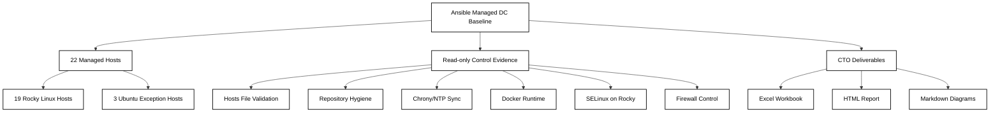

# Managed DC Baseline Overview

```mermaid
flowchart TB
    A["Ansible Managed DC Baseline"] --> B["22 Managed Hosts"]
    B --> C["19 Rocky Linux Hosts"]
    B --> D["3 Ubuntu Exception Hosts"]
    A --> E["Read-only Control Evidence"]
    E --> F["Hosts File Validation"]
    E --> G["Repository Hygiene"]
    E --> H["Chrony/NTP Sync"]
    E --> I["Docker Runtime"]
    E --> J["SELinux on Rocky"]
    E --> K["Firewall Control"]
    A --> L["CTO Deliverables"]
    L --> M["Excel Workbook"]
    L --> N["HTML Report"]
    L --> O["Markdown Diagrams"]

    classDef bw fill:#ffffff,stroke:#000000,color:#000000,stroke-width:1.5px;
    class A,B,C,D,E,F,G,H,I,J,K,L,M,N,O bw;
```
