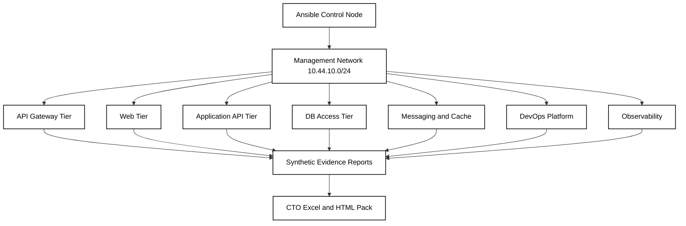

# Managed Datacenter Baseline Overview

```mermaid
flowchart TB
    A["Ansible Control Node"] --> B["Management Network 10.44.10.0/24"]
    B --> C["API Gateway Tier"]
    B --> D["Web Tier"]
    B --> E["Application API Tier"]
    B --> F["DB Access Tier"]
    B --> G["Messaging and Cache"]
    B --> H["DevOps Platform"]
    B --> I["Observability"]
    C --> J["Synthetic Evidence Reports"]
    D --> J
    E --> J
    F --> J
    G --> J
    H --> J
    I --> J
    J --> K["CTO Excel and HTML Pack"]

    classDef bw fill:#ffffff,stroke:#000000,color:#000000,stroke-width:1.5px;
    class A,B,C,D,E,F,G,H,I,J,K bw;
```
