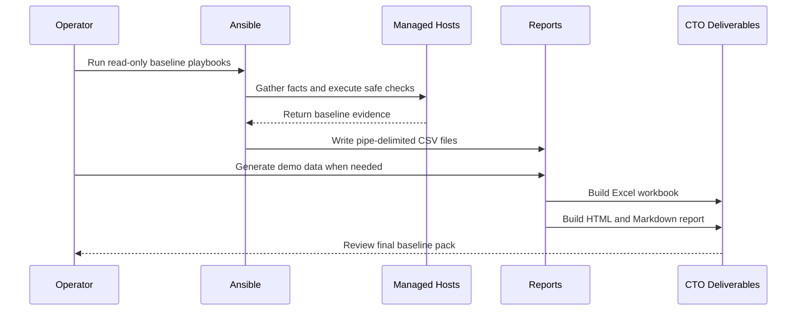

# Final Audit Workflow

```mermaid
sequenceDiagram
    participant Operator
    participant Ansible
    participant Hosts as Managed Hosts
    participant Reports
    participant Executive as CTO Deliverables

    Operator->>Ansible: Run read-only baseline playbooks
    Ansible->>Hosts: Gather facts and execute safe checks
    Hosts-->>Ansible: Return baseline evidence
    Ansible->>Reports: Write pipe-delimited CSV files
    Operator->>Reports: Generate demo data when needed
    Reports->>Executive: Build Excel workbook
    Reports->>Executive: Build HTML and Markdown report
    Executive-->>Operator: Review final baseline pack
```
