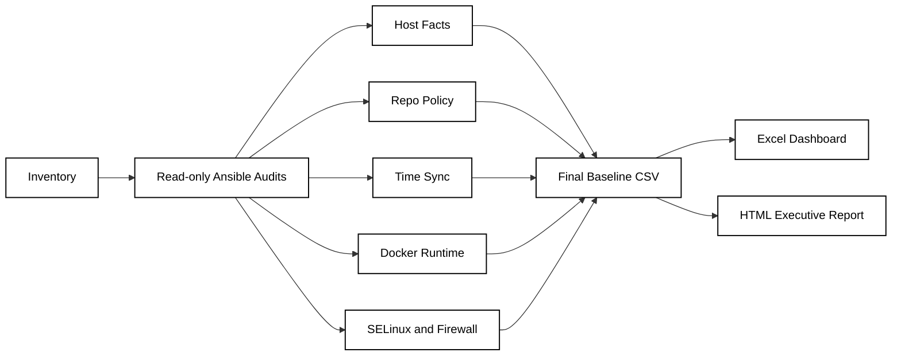

# Final Audit Workflow

```mermaid
flowchart LR
    A["Inventory"] --> B["Read-only Ansible Audits"]
    B --> C["Host Facts"]
    B --> D["Repo Policy"]
    B --> E["Time Sync"]
    B --> F["Docker Runtime"]
    B --> G["SELinux and Firewall"]
    C --> H["Final Baseline CSV"]
    D --> H
    E --> H
    F --> H
    G --> H
    H --> I["Excel Dashboard"]
    H --> J["HTML Executive Report"]

    classDef bw fill:#ffffff,stroke:#000000,color:#000000,stroke-width:1.5px;
    class A,B,C,D,E,F,G,H,I,J bw;
```
