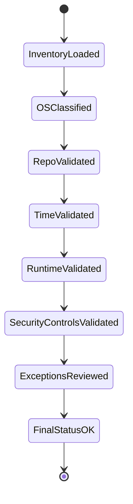

# Control Validation Flow

```mermaid
stateDiagram-v2
    [*] --> InventoryLoaded
    InventoryLoaded --> OSClassified
    OSClassified --> RepoValidated
    RepoValidated --> TimeValidated
    TimeValidated --> RuntimeValidated
    RuntimeValidated --> SecurityControlsValidated
    SecurityControlsValidated --> ExceptionsReviewed
    ExceptionsReviewed --> FinalStatusOK
    FinalStatusOK --> [*]
```
