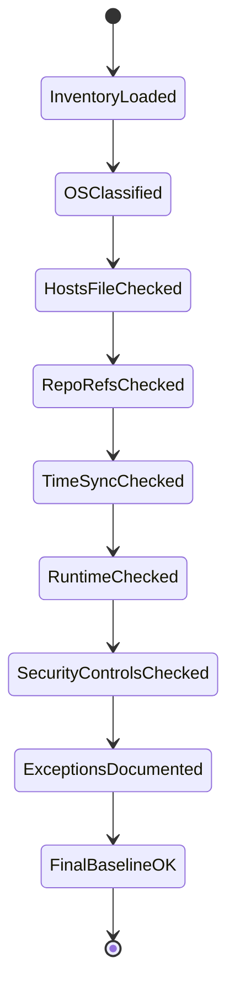

# Control Validation Flow

```mermaid
stateDiagram-v2
    [*] --> InventoryLoaded
    InventoryLoaded --> OSClassified
    OSClassified --> HostsFileChecked
    HostsFileChecked --> RepoRefsChecked
    RepoRefsChecked --> TimeSyncChecked
    TimeSyncChecked --> RuntimeChecked
    RuntimeChecked --> SecurityControlsChecked
    SecurityControlsChecked --> ExceptionsDocumented
    ExceptionsDocumented --> FinalBaselineOK
    FinalBaselineOK --> [*]
```
